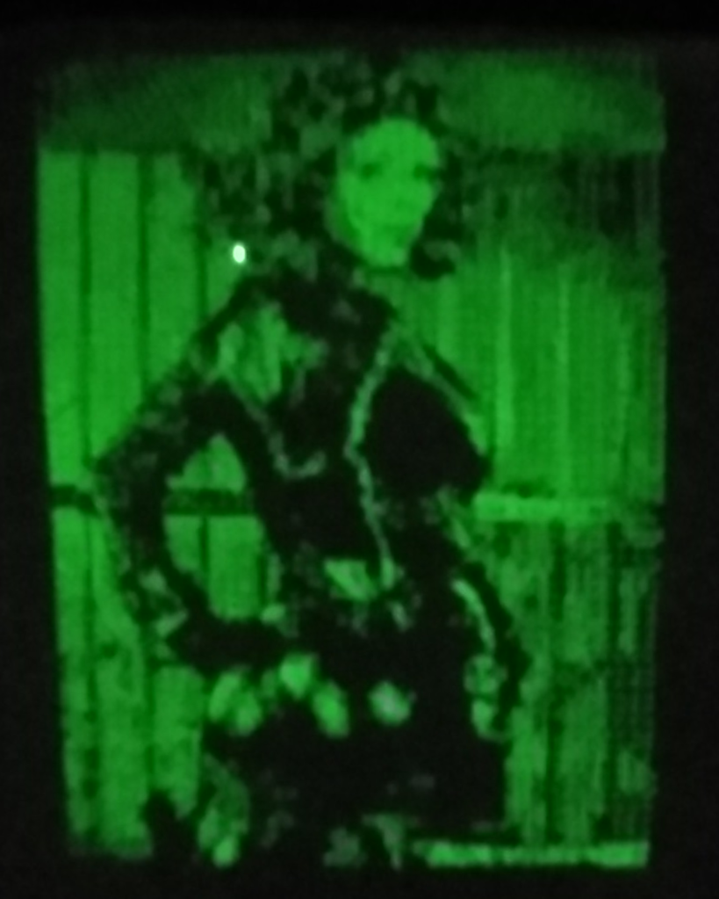

# Вывод изображения на электроннолучевую трубку 6ЛО1И
Проект по выводу изображения на электроннолучевую трубку 6ЛО1И. В дириктории schematic лежат принципиальные схемы блока питания трубки, видеоусилителя и ЦАП.
Цифровой сигнал на ЦАП подаётся с USB/SPI конвертера FT232H. Для сборки потребуются библиотеки OpenCV, OpenMPI и libmpsse, последнюю можно найти в соответствующей директории или на [AUR](https://aur.archlinux.org/packages/libmpsse).

Непосредственно векторизацию и вывод изображения на экран осуществляется программой black, после её выполнения создаётся заголовочный файл с изображением в виде массива координат точек, оптимизированный для отрисовки на CRT. Данный файл может быть впоследствии использован отдельно, как это сделанно в программе demo. Внимание, программа black рассчитана на работу в 8 потоков, при необходимости изменить число потоков нужно исправить num_threads(8) в исходном коде.

Для автоматической конвертации изображения в монохромный вид используются два скрипта kontur_gen.sh и kontur_gen2.sh, которым в качестве аргумента передаётся файл изображения. kontur_gen.sh генерирует и выводит на экран растровую картинку, тогда как kontur_gen2.sh выделяет контуры изображения. kontur_gen2.sh требует второго числового аргумента регулирующего чувствительность поиска контуров, оптимальный параметр 2. Для работы обоих скриптов необходим пакет imagemagic.

Программа text демонстрирует вывод текста на экран, текст передаётся в виде параметра, кириллица ограниченно поддерживается. 

Программа sin выводит на экран фигуры Лиссажу. 

В директории bluepill находится пример генерации изображения микроконтроллером.

##Примеры использования
$./kontur_gen.sh test.jpg

$./kontur_gen2.sh test.jpg 2

$./text

$./sin

$./demo

Александр Белый 2022
